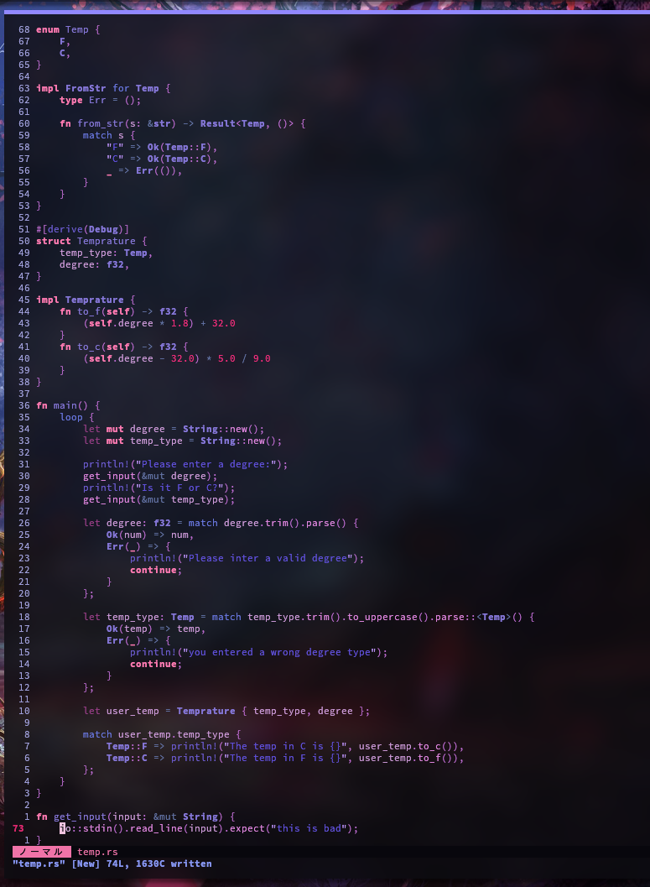
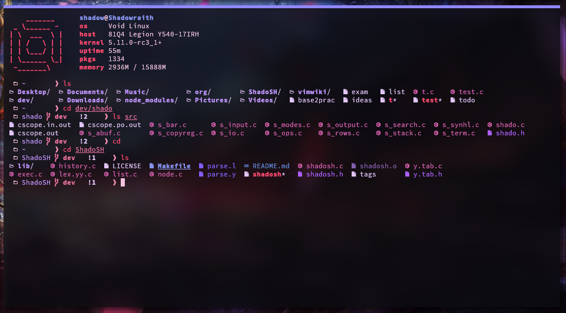

# shadotheme

My ultimate purple and pink dark cherryblossom theme!
For all my screenshots and everything I use Source Code Pro as my font.

* [Installation](#Installation)
  * [Vim/Nvim](#Vim / Nvim)
  * [Terminal](#Terminal)
    * [Shell](#Shell)
    * [ST](#ST)
* [Screenshots](#Screenshots)

## Installation

This repo will grow overtime with many different colorschemes for different
software. Right now the only two are Vim/Nvim and Shell theme.

### Vim / Nvim

To install this colorscheme for vim or neovim, copy the `syntax/` and `colors/`
folders into your vim/nvim configuration directory.
As a side note, if you would like my neovim set up, you can get it here:
[Shadovim](https://github.com/Shadorain/shadovim)

For vim (be warned, some things may not work perfectly since this is only tested
for neovim):

```bash
mkdir ~/.vim/colors/ ~/.vim/syntax/
ln ./colors/* ~/.vim/colors/
ln ./syntax/* ~/.vim/syntax/
```

For nvim:

```bash
mkdir ~/.config/nvim/colors/ ~/.config/nvim/syntax/
ln ./colors/* ~/.config/nvim/colors/
ln ./syntax/* ~/.config/nvim/syntax/
```

Finally in your `.vimrc` or `init.vim` set the colorscheme:

```vim
colorscheme xshado
```

#### Lightline

To install the theme for the lightline bar in neovim use:

```bash
ln -sf ./shado_lightline.vim ~/.local/share/nvim/plugged/lightline.vim/autoload/lightline/colorscheme/deus.vim
```

In vim set the lightline theme to `deus.vim` (note I did this because I havent found
a way to add a custom theme so I overwrote one of the default ones)

```vim
let g:lightline = { 'colorscheme': 'deus' }
```

### Terminal

To install my terminal colorscheme it is up to your terminal honestly.
Here is the colorpallate:

```
black       #140a1d 
red         #B52A5B 
green       #FF4971 
yellow      #8897F4 
blue        #bd93f9 
magenta     #E9729D 
cyan        #F18FB0 
white       #f1c4e0 
 black      #a8899c 
red         #B52A5B 
green       #FF4971 
yellow      #8897F4 
blue        #bd93f9 
magenta     #E9729D 
cyan        #F18FB0 
white       #f1c4e0 
background  #09090d
foreground  #e3c7fc
cursor      #f1c4e0
```

#### Shell

To have special LS_COLORS, set this environment variable in your shell's
configuration:

```bash
LS_COLORS="rs=0:di=01;34:ln=01;36:mh=00:pi=40;33:so=01;35:do=01;35:bd=40;33;01:cd=40;33;01:or=40;31;01:mi=00:su=37;41:sg=30;43:ca=30;41:tw=30;42:ow=34;42:st=37;44:ex=01;32:*.md=38;5;68:*.log=38;5;68:*.c=38;5;169:*.h=38;5;135:*.o=38;5;97:*.y=38;5;99:*.l=38;5;99:*.sh=38;5;104"
EXA_COLORS="*.md=38;5;68:*.log=38;5;68:*.c=38;5;169:*.h=38;5;135:*.o=38;5;97:*.y=38;5;99:*.l=38;5;99:*.sh=38;5;104"
```

#### ST

This struct holds the colors for ST to handle. Copy and paste this
into `config.h` in your st directory and recompile.

```c
/* Terminal colors (16 first used in escape sequence) */
static const char *colorname[] = {
    /* 8 normal colors */
  [0] = "#140a1d", /* black   */
  [1] = "#B52A5B", /* red     */
  [2] = "#FF4971", /* green   */
  [3] = "#8897F4", /* yellow  */
  [4] = "#bd93f9", /* blue    */
  [5] = "#E9729D", /* magenta */
  [6] = "#F18FB0", /* cyan    */
  [7] = "#f1c4e0", /* white   */

  /* 8 bright colors */
  [8]  = "#a8899c",  /* black   */
  [9]  = "#B52A5B", /* red     */
  [10] = "#FF4971", /* green   */
  [11] = "#8897F4", /* yellow  */
  [12] = "#bd93f9", /* blue    */
  [13] = "#E9729D", /* magenta */
  [14] = "#F18FB0", /* cyan    */
  [15] = "#f1c4e0", /* white   */

  /* special colors */
  [256] = "#09090d", /* background */
  /* [257] = "#f1c4e0", /1* foreground *1/ */
  [257] = "#e3c7fc", /* foreground */
  [258] = "#f1c4e0",     /* cursor */
};
```

## Screenshots




